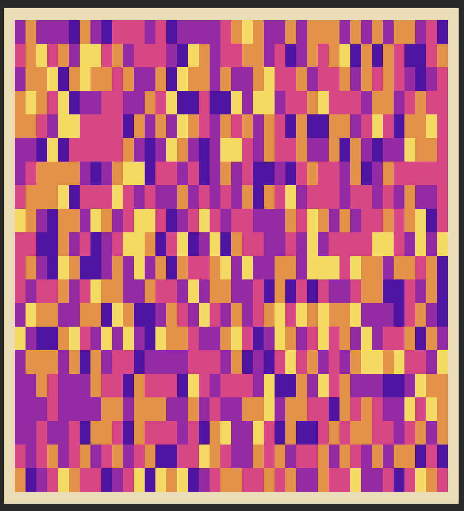

# PyTorch TUI Heatmap Visualizer for 1D Vectors and 2D Matrix Tensors


```python
a = torch.rand(40,20)
heater.plot(a, theme='heatmap')
```




```python
b = torch.linspace(0,1, steps=800).view(40,20)
heater.plot(b, theme='heatmap')
```


### Reference Charcodes for TUI

```python
##   Code    Result  Description
##   U+2580  ▀       Upper half block
##   U+2581  ▁       Lower one eighth block
##   U+2582  ▂       Lower one quarter block
##   U+2583  ▃       Lower three eighths block
##   U+2584  ▄       Lower half block
##   U+2585  ▅       Lower five eighths block
##   U+2586  ▆       Lower three quarters block
##   U+2587  ▇       Lower seven eighths block
##   U+2588  █       Full block
##   U+2589  ▉       Left seven eighths block
##   U+258A  ▊       Left three quarters block
##   U+258B  ▋       Left five eighths block
##   U+258C  ▌       Left half block
##   U+258D  ▍       Left three eighths block
##   U+258E  ▎       Left one quarter block
##   U+258F  ▏       Left one eighth block
##   U+2590  ▐       Right half block
##   U+2591  ░       Light shade
##   U+2592  ▒       Medium shade
##   U+2593  ▓       Dark shade
#  
#  a = torch.rand(10,10)
#  heater.plot(a) __init__.py
# ▄▄▄▄▄▄▄▄▄▄▄▄
# █    ░▓▒▓█▒█
# █   ░▒▓█▒░ █
# █  ░▒▓█▒░  █
# █ ░▒▓█▒░   █
# ▀▀▀▀▀▀▀▀▀▀▀▀ ▒
# ▀▀▀▀▀▀▀▀▀▒▒▒▒▒▒
# ╭━━━━━━━━━━━━━━━━━━╮
# ┃░▒  ▓  ▇  ▒       ┃
# ┃ ▒  ▓             ┃
# ┃ ▒                ┃
# ┃ ▒  ▄             ┃
# ┃ ▒  ▅             ┃
# ┃ ▒  ▆             ┃
# ╰━━━━━━━━━━━━━━━━━━╯
# ┌ ┐ └ ┘ ├ ┤ ┬ ┴ ┼ ─ │
# ╔ ╗ ╚ ╝ ╠ ╣ ╦ ╩ ╬ ═ ║
# ╭ ╮ ╯ ╰╯
# ┏ ┓ ┗ ┛ ┣ ┫ ┳ ┻ ╋ ━ ┃
# ▖

# ▗
# ▘
# ▙

# ▚

# ▛▀▀▀▀▀▀▀▀▄▄▄▄▜
# ▙▄▟

# ▜

# ▝
# ▞

# ▟
#  
# ▚
```
